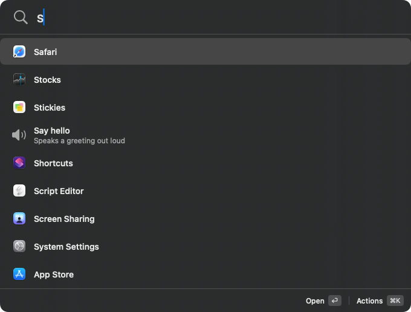

<p align="center">
  
</p>

# Pium!

A small, fast, native macOS launcher. A global shortcut opens a compact floating
bar above whatever you are doing; typing once searches applications,
Spotlight-indexed files, and file-based commands in a single ranked list.

<p align="center">
  
</p>

One list, one query. "Say hello" above is a plugin — a JSON file in a folder —
sitting among the applications rather than in a section of its own, because
from the keyboard there is no reason for it to be anywhere else.

Commands are plugins, and a plugin is one readable JSON file. Adding or changing
one never recompiles Pium!

```json
{
  "schemaVersion": 1,
  "id": "demo.hello",
  "name": "Say hello",
  "command": { "executable": "say", "arguments": ["Hello"] }
}
```

Drop that in `~/.config/pium/plugins/hello.pium.json` and it is searchable
without a restart. The whole format is in
[docs/plugin-format-v1.md](docs/plugin-format-v1.md), and `npx skills add
lardissone/pium` hands the same thing to a coding agent.

A plugin can take one argument. Press space on it and the result list gets out
of the way — the plugin becomes a pill, and everything typed after it belongs
to that plugin:

<p align="center">
  
</p>

`Backspace` on an empty argument goes back.

Bookmarks are the other half: name something once in Settings — a link, a
file, a folder — and open it from the launcher afterwards. Put `{{input}}` in
the destination and Pium asks for a value first, so a search URL becomes a
bookmark you can type into.

Bookmarked web sites are asked for their icon, once per site, and the answer is
kept on your Mac. That request is the only thing Pium fetches besides its own
updates; nothing else about a bookmark leaves the machine.

**Status:** early. The version number is honest about how much Pium has been
used by anyone other than its author.

## Installing

Download the DMG from [the latest
release](https://github.com/lardissone/pium/releases/latest), open it, and
drag Pium to Applications. It is signed with a Developer ID and notarized by
Apple, so it opens without a warning beyond the ordinary one macOS shows the
first time you launch anything.

Requires macOS 26.

Pium updates itself. It checks every six hours and, when something is
waiting, says so as a quiet row in the launcher the next time you open it —
never as a window over whatever you were doing. **Nothing installs until you
ask for it**, and there is no setting that changes that.

## Debug logging

Pium keeps no logs of what you do. When something goes wrong and you want to
report it, Settings → Advanced turns on debug logging for **24 hours**, after
which it stops on its own.

While it is on, Pium records what you type, the arguments you pass a plugin,
the commands it runs, and what they print, in
`~/Library/Application Support/Pium/DebugLogs/`. Nothing leaves your Mac: the
files are yours to export, read, and delete, and they are kept for seven days
or 20 MB, whichever comes first.

Secrets a plugin declares are removed — both where Pium uses them and from
whatever a command prints them into. **A secret you type by hand into a
plugin's argument cannot be removed**, because Pium cannot tell it apart from
anything else you typed. Read an export before you send it to anyone.

## Documentation

- [Plugin format v1](docs/plugin-format-v1.md) — every key, with what Pium enforces
- [Troubleshooting](docs/troubleshooting.md) — the messages Pium shows, and what to do about them
- [Security](SECURITY.md) — what Pium guarantees, and what it deliberately does not
- [Contributing](CONTRIBUTING.md) — house style and local hazards
- [Measuring latency](docs/measuring-latency.md) — the budgets and the recorded figures
- [Releasing](docs/releasing.md) — how a tag becomes a release, and the one key that must never be rotated

## Building

Requires macOS 26 and Xcode 26.

The Xcode project is generated from `project.yml` and is not checked in, so
generate it before opening anything:

```bash
brew install xcodegen   # once
xcodegen generate
open Pium.xcodeproj
```

Rerun `xcodegen generate` after editing `project.yml`. Changes made to the
generated project are discarded on the next run.

Signing uses your own team, which is not checked in. Create `Local.xcconfig`
in the repository root:

```
DEVELOPMENT_TEAM = YOURTEAMID
```

The ID is in Xcode → Settings → Accounts. Without it the unit tests still run
(`-only-testing:PiumTests CODE_SIGNING_ALLOWED=NO`), but `PiumUITests` and any
signed build do not. See [Signing.xcconfig](Signing.xcconfig).

From the command line:

```bash
xcodebuild test -project Pium.xcodeproj -scheme Pium -destination 'platform=macOS'
```

## License

MIT. See [LICENSE](LICENSE).
